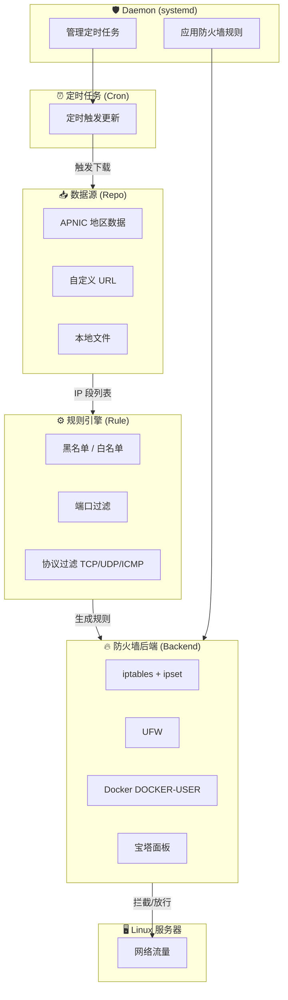

# Block Area Bot

基于地区 / IP段 / ASN 的 Linux 服务器访问屏蔽工具。

## 项目背景

服务器在公网运行时，经常面临来自特定地区或 IP 段的恶意扫描、暴力破解、DDoS 攻击等安全威胁。手动维护防火墙规则既繁琐又容易遗漏，且 IP 段数据需要定期更新。

**Block Area Bot** 旨在提供一个自动化、易用的解决方案：通过 CLI 命令快速添加 IP 段数据源，设置屏蔽规则，并以系统服务的形式在后台运行，自动定时更新 IP 数据并应用防火墙规则。

## 功能特性

- 🌍 **地区屏蔽** — 支持基于 APNIC 数据按国家/地区代码屏蔽整个地区的 IP 段
- 📋 **自定义 IP 源** — 支持添加本地文件或远程 URL 作为 IP 段数据源（IPv4/IPv6）
- 🔥 **多防火墙后端** — 自动检测并支持 iptables、UFW、Docker (DOCKER-USER)、宝塔面板
- ⏰ **定时更新** — 内置定时任务，自动更新 IP 段数据并刷新防火墙规则
- 🎯 **精细控制** — 支持按端口、协议（TCP/UDP/ICMP）设置黑名单或白名单规则
- 🖥️ **系统服务** — 以 systemd 服务运行，支持开机自启动
- 📦 **一键安装** — 提供一键安装脚本，支持多种 Linux 发行版

## 工作原理



**各模块职责：**

1. **数据源管理 (Repo)**：从 APNIC、自定义 URL 或本地文件获取 IP 段列表
2. **规则引擎 (Rule)**：将数据源与屏蔽策略（黑名单/白名单、端口、协议）关联
3. **防火墙后端 (Backend)**：自动检测系统防火墙类型，使用 ipset 高效管理大量 IP 段
4. **定时任务 (Cron)**：按设定周期自动更新数据源并刷新防火墙规则
5. **守护进程 (Daemon)**：以 systemd 服务形式运行，管理定时任务和规则应用

### 防火墙后端支持

| 后端 | 说明 | 适用场景 |
|------|------|----------|
| **iptables + ipset** | 默认后端，使用 ipset 存储 IP 集合，iptables 引用 | 通用 Linux 服务器 |
| **UFW** | 通过 ufw-before-input 链管理规则 | Ubuntu/Debian 使用 UFW 的服务器 |

#### 环境兼容

iptables 后端会**自动检测**并兼容以下环境，无需额外配置：

| 环境 | 兼容方式 | 说明 |
|------|----------|------|
| **Docker** | 自动在 `DOCKER-USER` 链中插入规则 | 确保容器流量也被正确拦截（Docker 的 FORWARD 链绕过 INPUT） |
| **宝塔面板** | 自动在 `BT-INPUT` 链中插入规则 | 兼容宝塔对 iptables 的链结构修改 |

程序会自动检测当前系统环境并选择合适的后端，同时自动兼容 Docker 和宝塔面板的防火墙链结构，无需手动配置。

## 安装

### 一键安装（推荐）

```bash
# 安装最新 beta 版本
curl -fsSL https://raw.githubusercontent.com/PIKACHUIM/BlockAreaBot/main/install.sh | sudo bash

# 指定版本安装
curl -fsSL https://raw.githubusercontent.com/PIKACHUIM/BlockAreaBot/main/install.sh | sudo bash -s -- --version 1.0.0
```

### 手动安装

1. 从 [Releases](https://github.com/PIKACHUIM/BlockAreaBot/releases) 页面下载对应架构的二进制包
2. 解压并安装：

```bash
tar -xzf block-linux-amd64.tar.gz
sudo install -Dm755 block /usr/local/bin/block
sudo install -Dm644 dist/block-area-bot.service /etc/systemd/system/block-area-bot.service
sudo systemctl daemon-reload
```

### 系统要求

- Linux 操作系统（x86_64 / arm64）
- root 权限
- iptables + ipset（安装脚本会自动安装依赖）

## 使用方法

### 快速开始

```bash
# 1. 添加中国 IP 段数据源
block repo add --type apnic:cn

# 2. 屏蔽中国 IP 访问
block rule ban cn

# 3. 设置每 3 天自动更新
block cron add cn 3d

# 4. 启动服务并设置开机自启
block enable
block start
```

### 查看总览

```bash
block list    # 显示服务状态、源、规则、定时任务总览
```

## 命令参考

### 服务管理

| 命令 | 说明 |
|------|------|
| `block start` | 启动屏蔽服务 |
| `block stop` | 停止屏蔽服务 |
| `block enable` | 设置开机自启动 |
| `block disable` | 关闭开机自启动 |
| `block status` | 显示服务状态 |
| `block list` | 显示总览信息 |

### 数据源管理 (repo)

```bash
# 查看所有数据源
block repo list

# 添加 APNIC 地区数据源（自动从 APNIC 下载对应地区 IP 段）
block repo add --type apnic:cn
block repo add --type apnic:ru --tag russia

# 添加自定义 IPv4 数据源
block repo add --type ipv4 --tag my-blacklist https://example.com/blacklist.txt
block repo add --type ipv4 --tag local-list /path/to/iplist.txt

# 添加 IPv6 数据源
block repo add --type ipv6 --tag ipv6-block https://example.com/ipv6list.txt

# 删除数据源
block repo del cn
block repo del russia
```

### 规则管理 (rule)

```bash
# 屏蔽指定数据源的所有 IP（黑名单模式，默认全端口全协议）
block rule ban cn

# 只允许指定数据源的 IP 访问（白名单模式）
block rule ban cn --mode white

# 屏蔽指定端口范围
block rule ban cn --port 10000-19999

# 屏蔽指定协议
block rule ban cn --tcp
block rule ban cn --udp
block rule ban cn --icmp

# 组合使用
block rule ban cn --port 22 --tcp

# 删除规则
block rule del cn
block rule del 1    # 按规则 ID 删除
```

### 定时任务管理 (cron)

```bash
# 查看所有定时任务
block cron list

# 添加定时更新（支持: 1h=1小时, 3d=3天, 1w=1周）
block cron add cn 3d      # 每 3 天更新中国 IP 段
block cron add russia 1w  # 每 1 周更新俄罗斯 IP 段

# 删除定时任务
block cron del cn
```

## 文件路径

| 路径 | 说明 |
|------|------|
| `/usr/local/bin/block` | 可执行文件 |
| `/etc/block-area-bot/config.json` | 配置文件 |
| `/var/lib/block-area-bot/` | 数据目录（IP 段缓存等） |
| `/var/log/block-area-bot/` | 日志目录 |
| `/etc/systemd/system/block-area-bot.service` | systemd 服务文件 |

## 构建

```bash
# 依赖 Go 1.22+
make build

# 或直接使用 go build
go build -o block .
```

## 开源协议

本项目基于 [AGPL-3.0](LICENSE) 协议开源。
